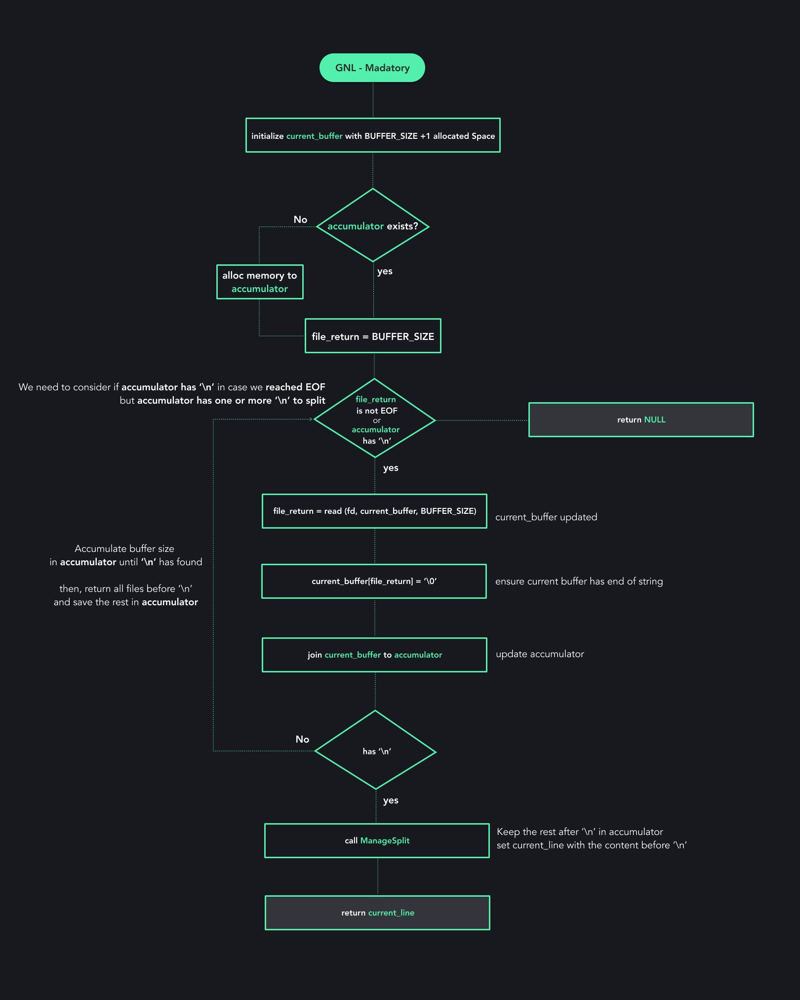

<p align="center">

</p>
<h1 align="center">Get Next Line (affectionately called GNL) </h1>
<p align="center">


</p>
<p align="center">Function that returns a line read from a file descriptor: we should be
able to call getNextLine(int fd) multiple times and returns one line at a time.</p>

<h2>Learned concepts</h2>
<ul>
<li>Static Variables</li>
<li>Pointers</li>
<li>Memory allocation</li>
<li>Analyse and Avoid Memory Leaks</li>
<li>Linked Lists (used in bonus part)</li>
</ul>

<br/>

<h1 align="center">Flow Diagram</h1>
<p align="center">

</p>


<br/>

<h1>Getting Started</h1>
<p>To run this project, first you need to create a main file with a file, passing BUFFER_SIZE parameter when build the application</p>

<br />

<h2>Creating a function to call GNL in root folder</h2>

```c
void testGnl(char *file_path, char *test_name)
{
	FILE *file;
	int i;
	char *current_line;

	printf("----------------------------------------------------------\n");
	printf("-> TEST %s\n", test_name);					
	printf("----------------------------------------------------------\n");

	i = 0;
	file = fopen(file_path, "r");
	
	// to get FD in linux use file->_fileno
	// to get FD in macos use file->_file
	while ((current_line = get_next_line(file->_fileno)) != NULL)
	{
		printf("Line %i : '%s'\n", i, current_line);
		free(current_line);
		i++;
	}

	fclose(file);
	printf("\n");
	printf("\n");
}
```

<h3>Creating a file(example) to test</h3>

```
ABC
DE
FGHIJK
```

<h3>Creating the main function</h3>

```c
#include "get_next_line.h"

#include <stdio.h>
#include <stdlib.h>

void testGnl(char *file_path, char *test_name);

int main(void)
{
	testGnl("./example", "GNL Example");
}
```

<h3>Creating a compiled file and running</h3>

```bash
cc -c get_next_line.c get_next_line_utils.c -D BUFFER_SIZE=4
cc get_next_line.o get_next_line_utils.o main.c -g
./a.out
```

<h3>Checking leaks with valgrind</h3>

```bash
valgrind --leak-check=full ./a.out
```


